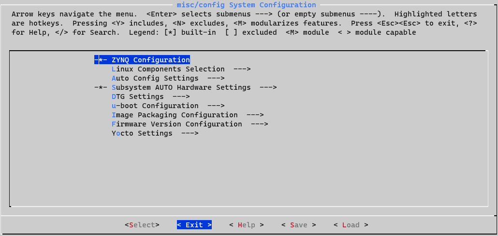

# PetaLinux on Windows 10 with WSL

Normally, if you want to run PetaLinux on Windows 10 machine, it is required to run Linux in VirtualBox. However, Windows Subsystem Linux 2 (WSL2) has solved this problem, and the performance of running PetaLinux has increase greatly instead of running it on a virtual machine.

I will share the installation guide and the step that how I run PetaLinux on Windows 10 machine without VirtualBox.

The version of PetaLinux that I will be using is 2018.3 and the full PetaLinux-2018.3 reference guide is at [here](https://www.xilinx.com/support/documentation/sw_manuals/xilinx2018_3/ug1144-petalinux-tools-reference-guide.pdf).

## Prerequisite
1. Install WSL2. Please follow this [guide](https://docs.microsoft.com/en-us/windows/wsl/install-win10) from step 1 until step 5.

2. Download and Install [Ubuntu-16.04.6](https://aka.ms/wsl-ubuntu-1604).

    If you are using the other version of PetaLinux, you will need to install its supported version of Linux OS. Here, you can choose [different version of Ubuntu](https://docs.microsoft.com/en-us/windows/wsl/install-manual) that you can install.

    Notes: According to the manual, the supported OS for PetaLinux-2018.3 are Ubuntu Linux 16.04.3, 16.04.4 (64-bit). However, windows only provides WSL Ubuntu-16.04.6, but it still works for me. So, use it at your own risk.

4. Install and run VcXsrv on you Windows 10 machine.

    Notes: This step is required, because a windows will pop up while executing petalinux.

5. Add the following line into the file ~/.bashrc of the installed WSL2-Ubuntu-16.04.6. [Checkout this solution](https://stackoverflow.com/a/43399827/10058074).
```bash
export DISPLAY=`grep -oP "(?<=nameserver ).+" /etc/resolv.conf`:0.0
```

## Installation
1. Download [petalinux-2018.3](https://www.xilinx.com/member/forms/download/xef.html?filename=petalinux-v2018.3-final-installer.run).

2. Open Ubuntu-16.04.6 terminal

3. [Add system architecture](https://wiki.debian.org/Multiarch/Implementation) and update you sudo apt.
```bash
dpkg --add-architecture i386
sudo apt update
```

4. Install the environment for petalinux:
```bash
sudo apt-get install -y gcc git make net-tools libncurses5-dev tftpd zlib1g-dev libssl-dev flex bison libselinux1 gnupg wget diffstat chrpath socat xterm autoconf libtool tar unzip texinfo zlib1g-dev gcc-multilib build-essential libsdl1.2-dev libglib2.0-dev zlib1g:i386 screen pax gzip
```

5. Make directory to install petalinux:
```bash
mkdir -p ~/petalinux/2018.3/
```

6. Install petalinux:
```bash
<PATH-TO-PETALINUX-INSTALLER>/petalinux-v2018.3-final-installer.run ~/petalinux/2018.3
```

Notes: The error related to tftp server will occur, and I'm ignoring this, because I'm not using the tftp server on WSL2 to transfer file to my fpga.

## Run PetaLinux

1. Source the petalinux, create the petalinux project and get the hardware description of your vivado project.
```bash
source ~/petalinux/2018.3/settings.sh
petalinux-create --type project --template zynq --name peta_project0
cd peta_project0
petalinux-config --get-hw-description <PATH-TO-VIVADO-PROJECT>/project_*.sdk/
```

A system configuration will pop up and exit it.



2. Build and package the BOOT.BIN & images.ub file.
```bash
petalinux-build
petalinux-package --boot --format BIN --fsbl images/linux/zynq_fsbl.elf --u-boot images/linux/u-boot.elf --fpga images/linux/system.bit --force
```

## References
- https://www.xilinx.com/support/documentation/sw_manuals/xilinx2018_3/ug1144-petalinux-tools-reference-guide.pdf
- https://stackoverflow.com/a/43399827/10058074
- https://docs.microsoft.com/en-us/windows/wsl/install-manual
- https://wiki.debian.org/Multiarch/Implementation
- https://forums.xilinx.com/t5/Embedded-Linux/Installation-of-PetaLinux-in-Windows-10/td-p/1168468